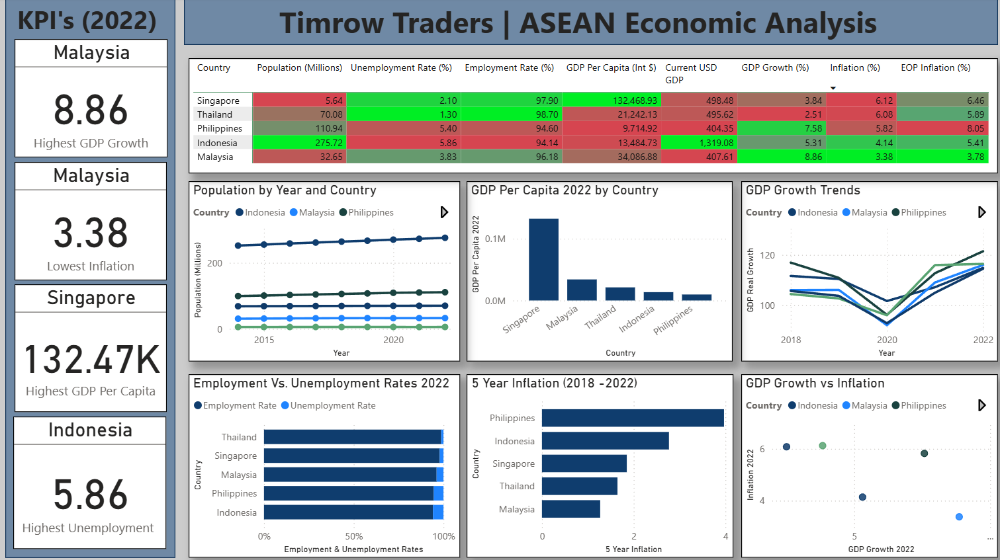

# Timrow Traders – ASEAN Economic Analysis

Project Type: Economic Market Assessment  
Tools Used: Python (Pandas), SQL Server, Power BI  
Data Source: IMF World Economic Outlook (WEO)

---

## Background and Overview

Timrow Traders is currently exploring opportunities to expand their operations internationally, with a focus on ASEAN countries. To support this strategic decision, the company is conducting a comprehensive analysis of key economic indicators across potential target countries.

The dataset includes the following metrics over the past 10 years:

- Current_USD_GDP: Gross Domestic Product at current prices in U.S. dollars  
- GDP_PPP: Gross Domestic Product at current prices, adjusted for Purchasing Power Parity (PPP) in international dollars  
- GDP_PerCapita_PPP: Gross Domestic Product per capita, constant prices, PPP adjusted to 2021 international dollars  
- Unemployment_Rate: Percentage of total labor force unemployed  
- Employment: Total number of employed persons, derived from Unemployment_Rate  
- Population: Total population count (in millions)  
- GDP_Real_Growth: Year-over-year percent change in Gross Domestic Product at constant prices  
- Inflation_Avg: Average annual percent change in consumer prices (inflation)  
- Inflation_EndPeriod: Inflation rate at the end of each period  

---

## Data Source and Preparation

The data used in this analysis was sourced from the International Monetary Fund’s (IMF) World Economic Outlook (WEO) database.

To enable efficient querying and comparison:

- Two separate datasets were cleaned and melted using Python (Pandas)  
- Data was standardized for numeric formatting and consistent country names  
- Employment rate was derived using the unemployment rate  
- Cleaned data was loaded into a SQL Server relational database  
- Power BI was used for data visualization and analysis  

---

## Dataset Overview

### Dataset 1

| Macro_Economic      |
|---------------------|
| Country             |
| Year                |
| Economic_Indicator  |
| Value               |

Economic Indicators:

- Current_USD_GDP: Gross Domestic Product at current prices in U.S. dollars  
- GDP_PPP: GDP at current prices adjusted for PPP in international dollars  
- GDP_PerCapita_PPP: GDP per capita (PPP adjusted to 2021 dollars)  
- Unemployment_Rate: Percent of total labor force unemployed  
- Employment_Rate: Derived from Unemployment_Rate  
- Population_Millions: Total population  

### Dataset 2

| Rates_Economic      |
|---------------------|
| Country             |
| Economic_Indicator  |
| Year                |
| Value               |

Economic Indicators:

- GDP_Real_Growth: Year-over-year change in GDP at constant prices  
- Inflation_Avg: Average annual inflation rate  
- Inflation_EndPeriod (EOP): Inflation rate at the end of each year  
- Unemployment_Rate: Percent of total labor force that is unemployed  

---

## Executive Overview

### Top Performing Countries

#### GDP per Capita  
GDP per capita is used to estimate living standards. A higher value often correlates with better access to goods and services.

- Top performers:  
  - Singapore ($132,468.93)  
  - Malaysia ($34,086.88)  
  - Thailand ($21,242.13)  
- Lowest: Philippines ($9,714.92)

Note that while GDP per capita is useful for comparison, it doesn't fully capture individual well-being (Callen, IMF).

#### Unemployment Rate  
Although a lower unemployment rate is more representative of a healthier economu, a higher unemployment rate may suggest a larger available labor force, which can benefit businesses needing to hire locally.

- Highest rates:  
  - Indonesia (5.86%)  
  - Philippines (5.4%)  
  - Malaysia (3.83%)  

#### Inflation (2022)  
Lower inflation indicates more stable purchasing power for consumers.

- Most stable:  
  - Philippines (5.82%)  
  - Indonesia (4.14%)  
  - Malaysia (3.38%)  

These indicators provide a helpful starting point for narrowing down high-potential markets for expansion.

---

## Power BI Dashboard

---

## Best Countries for Expansion

### 1. Malaysia

Malaysia combines solid economic indicators with stability:

- GDP per capita: $34,086.88 – high living standards  
- GDP growth (2022): 8.862% – second highest amongst countries analyzed  
- Unemployment rate: 3.83% – moderate availability of labor  
- Employment rate: 96.175%  
- Inflation: Most stable at 3.38%  

Consistent performance across all indicators suggests a reliable environment for expansion

### 2. Philippines

The Philippines presents strong growth potential and a large market:

- GDP growth (2022): 7.581% – largest recovery post-COVID  
- Unemployment rate: 5.4% – labor supply is available  
- Employment rate: 94.6%  
- Population growth: From 105.76M (2018) to 110.94M (2022)  
- Inflation: Higher than Malaysia, but stable relative to others (5.82%)  

Despite lower GDP per capita, its growing population and economic momentum make it attractive

### 3. Indonesia

Indonesia is the region’s largest market and labor force:

- Population (2022): 275.72M – largest amongst countries analyzed  
- GDP growth (2022): Recovering steadily  
- Unemployment rate: 5.86% – highest among the group, indicating labor availability  
- Employment rate: 94.14%  
- Inflation: Moderate at 4.14%  

Strong and consistent population growth makes Indonesia a scalable option for market entry

---

## Insights Deep Dive and SQL Queries

### 1. GDP Growth Trends (2018–2022)

- All five countries saw a GDP dip in 2020  
- Philippines had the largest drop (-9.518%) and highest rebound (7.581%) in 2022  
- Malaysia had the highest GDP growth in 2022 (8.862%)  

### 2. GDP Per Capita Classification (2022)

- High: Singapore, Malaysia  
- Middle: Thailand, Indonesia  
- Upper-Middle (lowest): Philippines  

Although Philippines is classified as Upper-Middle based off of the World Bank Thresholds, IMF notes that GDP per capita doesn't capture full well-being (Callen, n.d.). Further analysis is necessary to truly get a picture of the well being of the country.

### 3. Unemployment Trends (2020–2022)

- No ASEAN country experienced a continuous 3-year increase  
- Rates remained relatively stable or improved  

### 4. Employment Rate Category (2022)

- Highest: Thailand (98.7%), Singapore (97.9%)  
- Lowest: Indonesia (94.14%)  
- All countries have relatively high employment overall  

### 5. GDP Growth vs. Employment Rate (2022)

- Malaysia: Highest GDP growth (8.862%), 96.175% employment  
- Thailand: Highest employment (98.7%), lowest GDP growth (2.512%)  
- Philippines: 7.581% growth, 94.6% employment  

### 6. Average Inflation (2018–2022)

- Most stable:  
  - Malaysia (1.2698)  
  - Thailand (1.6464)  
- Most volatile:  
  - Philippines (3.9686)  

### 7. Inflation Category (2022)

- Moderate inflation: Malaysia (3.379%), Indonesia (4.139%)  
- Volatile inflation: Philippines (5.82%), Thailand, Singapore (6.121%)  

### 8. End-of-Period Inflation (2022)

- Moderate: Only Malaysia (3.775%)  
- Others showed higher volatility  
- Philippines: 8.054% (highest EOP inflation)  

### 9. Population Growth (2018–2022)

- Highest growth: Indonesia (264.162M to 275.72M), Philippines (105.76M to 110.94M)  
- Lowest growth: Thailand (69.428M to 70.078M)  
- Singapore had a temporary dip in 2021, but recovered in 2022

---

## Conclusion

The ASEAN economic analysis conducted for Timrow Traders offers a comprehensive view of the region’s macroeconomic landscape, enabling data-driven insights for international expansion. After evaluating a wide array of indicators (such as GDP growth, unemployment, inflation stability, population trends, and purchasing power), three countries emerged as strong candidates for market entry: Malaysia, Philippines, and Indonesia

While each country presents unique strengths and risks, these three represent the most strategic opportunities for Timrow Traders’ ASEAN expansion. Ongoing monitoring of inflation volatility and employment trends will be critical to refining the company’s entry strategy and ensuring sustainable operations in the chosen markets.

---

## Works Cited

Hamadeh, N., Van Rompaey, C., Metreau, E., & Grace Eapen, S. (2022, July 1). *New World Bank country classifications by income level: 2022-2023*. World Bank Blogs.  
[https://blogs.worldbank.org/en/opendata/new-world-bank-country-classifications-income-level-2022-2023](https://blogs.worldbank.org/en/opendata/new-world-bank-country-classifications-income-level-2022-2023)

Callen, T. (n.d.). *Gross Domestic Product: An Economy’s All*. International Monetary Fund. Retrieved September 26, https://www.imf.org/en/Publications/fandd/issues/Series/Back-to-Basics/gross-domestic-product-GDP
